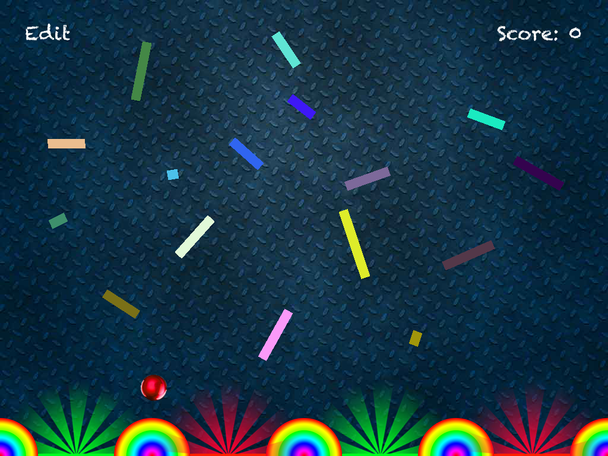

# PachinkoGame
Repo following Project 11 at www.hackingwithswift.com learning to use SpriteKit.  The goal of this project is to learn the basics of using SpriteKit to create a two-dimensional game.



## Concepts Learned/Practiced
* SpriteKit
  * ```SKSpriteNode``` - create objects in the scene which are referred to as 'nodes'.
  * Adding physics to nodes using ```SKPhysicsBody```
    * Turning on/off dynamic property of an SKPhysicsBody object so you can control whether that object will move/not move when colliding with other objects
  * ```SKAction```
    * Rotating sprites and repeating actions
  * Collision detection with ```SKPhysicsContactDelegate``` protocol
    * Being notified when things collide
* ```SKLabelNode```
* More use of property observers to monitor changes in the score and update the score label
* Using GameplayKit to randomize values for widths of rectangles
* ```SKEmitterNode``` - creating special effects with SpriteKit such as fire, smoke, sparks, etc.
* Recognizing opportunities to refactor code - put repeated code in methods and use for-in loops call those methods.

## Attributions
[Project 11: Pachinko with SpriteKit](https://www.hackingwithswift.com/read/11/overview)
